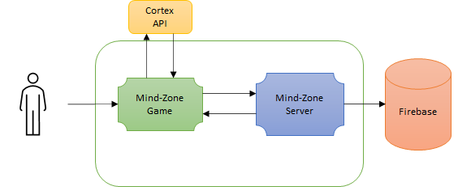
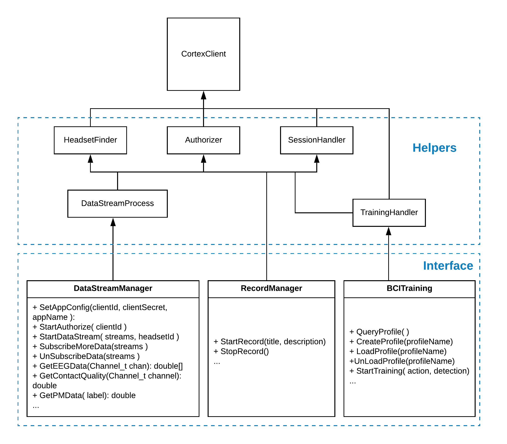
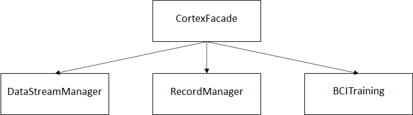
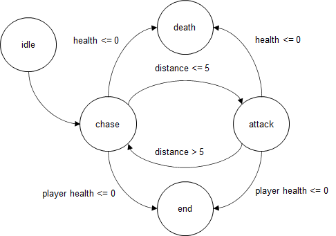
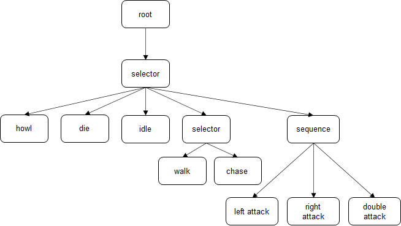

# MindZone - Game Control using Thoughts

MindZone is a First Person Shooter that allows the player to control the damage they produce by controlling their attention levels.

## Game Details

The player is set in a trapped dungeon with no
means of escaping. The dungeon is filled with
skeletons and mutated creatures which spawn in a
fixed interval. The objective of the game is to kill
as many of these enemies as possible. The game
ends once the health of the player reaches 0. 

The player can move anywhere along the floor of
the dungeon and has a speed of 15 units.
The skeleton has a base damage of 2 units and
movement speed 4 units. The creature on the
other hand has a base damage of 10, walking
speed of 3 units and running speed of 7 units.
The skeleton has 50 units of health, and the
creature has 100 units of health. 

| Enemy              | Damage        | Health        | Speed          |
| ------------------ | ------------- | ------------- | -------------- |
| Skeleton           | 2             | 50            | 4              |
| Scorpion Creature  | 10            | 100           | 3(Walk), 7(Run)|

The player is equipped with a gun with a base
damage of 10 units. The gun is equipped with an
enhancer that increases the damage based on the
player’s attention level.

Three spawners were created to drop enemies
into the dungeon. Each spawner has a unique
delay between each spawn and a variance. The
spawners rotate around an axis which is placed at
the centre of the dungeon. This is to ensure
randomness of the spawn. 

At the start of the game the skeleton has a spawn
probability of 0.85 and the creature has a spawn
probability of 0.15. After every spawn, the
probability of the creature spawning increases by
0.01 and the probability of the skeleton spawning
decreases by 0.75. However, the probability of the
creature spawning cannot increase 0.75.

## BCI Integration

The game was interfaced with the EEG headset
using the Cortex API and the EMOTIV BCI
Windows Application. The player must connect the
EEG headset using Bluetooth once connected, the
player must create a profile and train the in-built
classifier for 2 commands – “neutral” and
“attention”. The “neutral” command implies the
player is relaxed and the “attention” command
implies the player is attentive. This problem is now
transformed into a binary classification problem.

The Cortex API and Unity EMOTIV plugin was
used to receive the mental commands detected by
the headset. A C# script “CortexFacade.cs” was
created to abstract the relevant classes of the
plugin as an aggregation following the façade
design pattern improving maintainability of the
software for future improvements.

The “attention” command increases the base
damage of the player’s gun from 10 units to 50
units and heals the player by adding 0.01 units of
health if the player’s health is not 100 units. This
enables the player to defeat more enemies in a
shorter time

| Command              | Damage        | Skeleton Bullets        | Creature Bullets          |
| ------------------ | ------------- | ------------- | -------------- |
| neutral           | 10             | 5            | 10              |
| attention  | 50            | 1           | 2          |

## Game Architecture

1. The Player interacts with the Mind-Zone Game
2. The MindZone game reads data from the Cortex API and is connected to the EEG Headset using Bluetooth
3. The Mind-Zone server saves the player data gathered from the game to Firestore for further analysis

## Cortex API
The API and code used to integrate the Game with the EEG Headset can be found in this repository https://github.com/Emotiv/cortex-v2-example/tree/master/unity

The MindZone game uses a Facade Deign Pattern to encapsulate all the neceassry classes of the Cortex API into a single class

## Artificial Intelligence

The game contains two different types of enemies which are controlled by different Artificial Intelligent Algorithms

### Finite State Machine
The
skeleton is controlled by a Finite State Machine
(FSM) with 5 states. The initial state of the FSM is
the “idle” state, and the terminal states are the
“end” state and “death” state. The intermediate
states are the “chase” state and “attack” state. The
FSM toggles changes from the “chase” to the
“attack” state when the distance between the
player and the skeleton is less than or equal to 5
units. If the payer moves away, the state changes
back to the “chase” state. If the skeleton dies, the
FSM reaches the terminal “death” state and if the
player dies, the FSM reaches the “end” state.

### Behavious Trees
The creature is controlled by a behaviour tree with
1 root node, 2 selector nodes, 1 sequence node
and 8 leaf nodes.

The leaf nodes of the behavior tree are “howl”,
“die”, “idle”, “walk”, “chase”, “left attack”, “right
attack”, “double attack”. 

The selector evaluates the conditions from left to
right and the leaf node with the first successful
condition is the state selected. If the game is over,
then the selector chooses the “howl” node. If this
condition fails and the creature’s health is 0, the
selector chooses selects the “die” state.

Otherwise, if the creature has just spawned, the
node chosen is the “idle” node. The selector
contains another selector to evaluate. The second
selector must choose between the “walk” and
“chase” nodes. The creature will walk for the first
90 seconds of the game and after that it will run
with a greater speed. This is to ensure that the
difficulty of the game increases progressively. To
make the enemy AI more intelligent, a sequence
node was used to give it an attack pattern. The
creature hits the player with its left arm, then with
its right arm and finally with both arms. The
damage for all these types of attacks is the same.
Since the attack pattern can be thought of a
sequence of attacks, a sequence node is best to
model this behavior.

